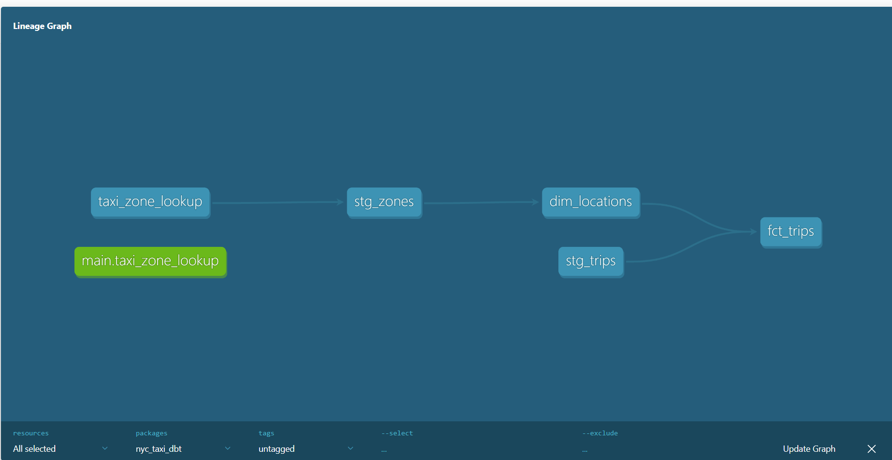

# NYC Taxi dbt Project 🚕

A dbt (data build tool) project built on NYC Yellow Taxi trip data 
for January 2025. Demonstrates a complete ELT transformation pipeline 
using dbt Core and DuckDB.

## Project Structure
nyc_taxi_dbt/
├── models/
│   ├── staging/          # Clean and rename raw source data
│   │   ├── stg_trips.sql      # 3.47M NYC taxi trips
│   │   └── stg_zones.sql      # 265 NYC taxi zones
│   └── marts/            # Business-ready models
│       ├── dim_locations.sql  # Location dimension table
│       └── fct_trips.sql      # Trip fact table with borough join
├── seeds/
│   └── taxi_zone_lookup.csv   # NYC taxi zone reference data
└── notebooks/
└── explore_data.ipynb     # Data exploration with DuckDB + pandas

## Architecture



**Data flow:**
`taxi_zone_lookup (seed)` → `stg_zones` → `dim_locations` → `fct_trips`
`yellow_tripdata_2025-01.parquet` → `stg_trips` → `fct_trips`

## Models

| Model | Type | Description |
|---|---|---|
| `stg_trips` | view | Staged taxi trips — renamed columns, filtered invalid records |
| `stg_zones` | view | Staged taxi zones from seed CSV |
| `dim_locations` | table | Location dimension — 265 NYC zones with borough |
| `fct_trips` | table | Fact table — one row per trip with pickup borough |

## Tests

23 dbt tests across all models including:
- `not_null` on all key columns
- `unique` on all primary keys
- `accepted_values` on vendor_id, rate_code_id, borough
- `relationships` — pickup_location_id references dim_locations

## How to Run

**Prerequisites:** Python 3.13+, dbt-core, dbt-duckdb

```bash
# Install dependencies
pip install dbt-core dbt-duckdb

# Load seed data
dbt seed

# Run all models
dbt run

# Run tests
dbt test

# Generate and serve documentation
dbt docs generate
dbt docs serve
```

## Data Source

NYC Taxi & Limousine Commission — Yellow Taxi Trip Records (January 2025)
https://www.nyc.gov/site/tlc/about/tlc-trip-record-data.page

## Tech Stack


